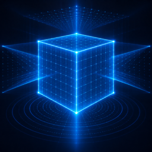

<p align="center">
  
</p>

<h1 align="center">ObjectScanner</h1>

An iOS app for 3D-scanning real objects and rooms with an iPhone's own sensors. Four
capture modes, one shared output contract, and an honest account of where each one
breaks.

Geometry is the goal here; texture is secondary.

**Languages:** English and Turkish. Turkish is the project's source language, so the
string literals in the code are Turkish and `Localizable.xcstrings` carries the
English translations. Comments and documentation are English throughout.

---

## Demo

Two screen recordings on an iPhone 16 Pro Max, one per technique.

**Object scan** — placing the bounding box, then orbiting a controller

https://github.com/user-attachments/assets/07cec01f-a252-463c-8efb-efe799beba40

**Room scan** — walls, doors and furniture, with the architectural/mesh choice

https://github.com/user-attachments/assets/089f6fd2-3ec4-4143-8409-5e9a073130e6

Both clips are also committed under [`docs/`](docs) so they survive in a clone.

---

## Requirements

| | |
|---|---|
| Device | iPhone or iPad **with LiDAR** (iPhone 12 Pro / iPad Pro 2020 or later) |
| iOS | 18.0 or later |
| Xcode | 16 or later (developed against the iOS 26/27 SDKs) |
| Mac | Any Apple silicon Mac, for the optional full-detail reconstruction |

The simulator is not useful: every mode needs real camera, LiDAR or TrueDepth
hardware, and the app checks for it at runtime rather than guessing from a device
list.

## Getting it running

```bash
git clone https://github.com/burakSahinkaya/ObjectScanner.git
cd ObjectScanner
open ObjectScanner.xcodeproj
```

Then, in Xcode:

1. Select the **ObjectScanner** target → **Signing & Capabilities**.
2. Set **Team** to your own Apple ID team. It is intentionally blank in the repo.
3. Change **Bundle Identifier** from `com.example.ObjectScanner` to something you
   own — `com.yourname.ObjectScanner`.
4. Plug in the device, select it, and press ⌘R.

A free Apple ID works. First launch on the device needs Developer Mode:
**Settings → Privacy & Security → Developer Mode**.

The project uses `PBXFileSystemSynchronizedRootGroup`, so files added under
`ObjectScanner/` are picked up automatically — no need to touch the project file.

---

## The four modes

Each mode is a different technique, not a quality tier. The app asks about the
*object* — size, finish, pattern — and recommends one, because the mode names mean
nothing to someone holding a shoe and picking wrong wastes several minutes.

### Photogrammetry

`ObjectCaptureSession` + `PhotogrammetrySession`. Apple's guided flow: place a
bounding box, orbit the object, and the app reconstructs a USDZ on device. Supports
multiple passes, including flipping the object to capture its underside.

Best results of the four, on one condition — see the table below.

### Turntable · beta

Phone fixed on a tripod, object rotating. `ObjectCaptureSession` cannot do this: its
guided flow is built on ARKit world tracking, so a stationary device reads as "never
moved" and the bounding box drifts off a turning object. `PhotogrammetrySession` has
no such dependency — it solves poses from the images themselves.

Adds, on top of the shared reconstruction:

- **Object mask.** Drag a rectangle over the object; only its interior is modelled.
  This is the reliable way to exclude a background, and it is only possible here
  because the device does not move, so one rectangle covers every frame.
- **Focus, exposure and white balance lock.** Left on automatic, focus breathing
  shifts the intrinsics between frames and the solve degrades.
- **Blur rejection.** Each frame is scored on gradient energy; anything below the
  floor is deleted and reshot.
- **Maximum still resolution** from `supportedMaxPhotoDimensions`, with LiDAR depth
  embedded in every HEIC so metric scale survives to the Mac.

### TrueDepth · beta

Front IR sensor with `ARFaceTrackingConfiguration` + `isWorldTrackingEnabled`, which
gives depth *and* synchronised 6DoF pose — the pose coming from the rear camera's
visual-inertial odometry. Depth arrives at ~15 Hz on a different clock from the pose,
so poses are interpolated (slerp for rotation, lerp for translation) to the depth
timestamp.

Points accumulate into a voxel-hashed grid at 1.5 mm and export as a binary PLY.
Still a point cloud, not a mesh, which is why it produces no preview.

### Room (RoomPlan)

Deliberately a *different* technique from the object modes rather than a bigger
version of them. Photogrammetry derives geometry from surface detail, which a bare
painted wall does not have. RoomPlan runs LiDAR plus a trained classifier and emits
walls, doors, windows, openings and furniture as understood entities — which is why
it succeeds on exactly the surfaces the other modes fail on, and why it will never
give you a detailed model of the chair, only a chair-shaped box.

Two export styles: `parametric` (clean boxes, small file, right for floor plans) or
`mesh` (the triangle mesh LiDAR actually measured).

**Optional photographic model.** RoomPlan produces no colour at all — its output is
geometry by design. But the camera frames are already flowing through the AR session
it runs on, so the app can pick keyframes out of that stream and feed them to the
existing photogrammetry pipeline. You get two library records from one walk: the
structure model (real dimensions, no colour) and the photographic model (textured, no
scale).

A **coverage dial** shows which directions have been photographed: sixteen sectors,
two rings (walls and floor), a needle for where the camera points now, and a haptic
tick per newly covered direction — because while walking a room you are looking at
the room, not at the screen.

---

## What actually determines quality

Measured on device, not inferred. Summarised here — the full write-up, including how to
reproduce each measurement, is in
**[docs/what-limits-quality.md](docs/what-limits-quality.md)**.

### Surface appearance decides the technique

| Object surface | Photogrammetry | TrueDepth |
|---|---|---|
| Textured, matte | Best geometry | Good, coarser |
| Flat single colour | Softens, detail lost | Fine |
| Matte black | Fine | Holes (IR absorbed) |
| Glossy / metallic | Poor | Poor |

In photogrammetry, **texture is an input, not an output.** Visual pattern on the
surface is the only source of frame-to-frame correspondence and therefore of
geometry. A featureless object starves it no matter how good the light or how many
photos you take.

### The iOS detail ceiling is the dominant limit

`PhotogrammetrySession.Request.Detail` declares **only `.reduced` on iOS**.
`.medium`, `.full` and `.raw` exist on macOS only — verified in the iOS 26.5 and 27.0
SDKs, not from documentation:

```
$ grep -A6 "public enum Detail" RealityFoundation.swiftinterface
public enum Detail : Swift::Int, Swift::Hashable {
  case reduced
  ...
```

`reduced` is a fixed budget per model: roughly 25,000 triangles and a single texture.
That is generous for a game controller and nowhere near enough for a room.

Same 75 frames, two levels:

| | Triangles | File | Look |
|---|---|---|---|
| iOS `reduced` | ~25,000 | — | unrecognisable, mushy |
| Mac `raw --room` | **331,116** | 36.7 MB | textured, furniture recognisable |

**13× the triangles.** For a single object the gap is smaller — measured at 2.3× —
and there `full` is the right target rather than `raw`: `raw` produces *identical*
geometry to `full` and differs only in material maps, including a 22 MB displacement
map that `full` bakes and `raw` leaves raw.

So: on-device reconstruction is a preview. The real output comes from the Mac, which
is why the app keeps the source images and offers a one-tap zip export.

### Capture geometry is measurable

`PhotogrammetrySession.Request.poses` (iOS 17+) reports the solved camera transforms.
It rides along on alignment work the session already does, so it is nearly free — and
it turns "the quality is bad" into three numbers:

- **alignment ratio** — how many frames the solver actually placed
- **azimuth coverage** — how much of a full turn the cameras cover
- **elevation spread** — the difference between the highest and lowest camera

Each maps to a distinct failure with a distinct fix, and the app says which one
applies. A soft mesh with 97% alignment and 75° of elevation spread is not a capture
problem, and no amount of re-walking will help.

The angular measures are reported **only for orbit captures**. Walking through a room
puts the cameras inside the volume looking outward, and some pass close to the
centroid where direction is numerically meaningless. Reporting angles there produced
healthy-looking numbers for a capture whose problem was elsewhere, which is worse than
reporting nothing.

---

## Architecture

Every mode meets the same output contract, so preview, export and library are written
once and stay engine-agnostic. Room mode was the test of that: a completely different
framework that captures no photographs at all — and nothing downstream changed.

```
ScanEngine (protocol)            Core/ScanEngine.swift
  ├── ObjectCaptureEngine        photogrammetry     ✅
  ├── TurntableCaptureEngine     turntable          beta
  ├── TrueDepthEngine            front IR depth     beta
  └── RoomCaptureEngine          RoomPlan / room    ✅
            ↓
      ScanRecord                 Core/ScanRecord.swift
            ↓
  ModelPreviewView · MeshExporter · ScanStorage · LibraryView
```

```
ObjectScanner/
├── Core/
│   ├── ScanEngine.swift          Protocol, ScanPhase, EngineAvailability, errors
│   ├── ScanEngineKind.swift      Mode identity, maturity (the beta badge)
│   ├── ScanRecord.swift          Persisted record + ReconstructionDetail
│   ├── DeviceCapabilities.swift  Runtime capability queries
│   └── ScanStorage.swift         Disk layout, library JSON, workspaces
├── Engines/ObjectCapture/
│   ├── ObjectCaptureEngine.swift         Session state machine → ScanPhase
│   ├── PhotogrammetryReconstructor.swift Images → USDZ
│   ├── PoseDiagnostics.swift             Solved poses → three numbers
│   └── ObjectCaptureFeedback.swift       Feedback/Tracking → coaching hints
├── Engines/Turntable/
│   ├── TurntableCaptureEngine.swift   Fixed phone, rotating object
│   ├── PhotoCaptureCoordinator.swift  Focus lock, max resolution, blur rejection
│   ├── ObjectMaskBuilder.swift        Rectangle → objectMask
│   └── MaskedSampleSequence.swift     Lazy PhotogrammetrySample stream
├── Engines/TrueDepth/
│   ├── TrueDepthEngine.swift       Session, region lock, PLY output
│   ├── DepthFrameReceiver.swift    Pose interpolation, frame gating
│   ├── DepthFrameProcessor.swift   Depth map → world points
│   └── DepthPointCloud.swift       Voxel-hashed accumulation
├── Engines/RoomPlan/
│   ├── RoomCaptureEngine.swift      Owns RoomCaptureView + delegate proxy
│   ├── RoomKeyframeCollector.swift  Keyframes + coverage sectors
│   ├── RoomExportStyle.swift        parametric ↔ mesh
│   └── RoomSummary.swift            Wall/door/object counts + dimensions
├── Export/
│   ├── MeshExporter.swift        USDZ / OBJ / PLY / STL (ModelIO)
│   ├── PointCloudFile.swift      Binary little-endian PLY
│   └── SourceImageBundle.swift   Zip for the Mac full-detail path
├── Features/                    SwiftUI screens
└── Localizable.xcstrings        English translations (source language: Turkish)
```

### Design decisions

**Capability detection at runtime.** `ObjectCaptureSession.isSupported`,
`PhotogrammetrySession.isSupported`, `RoomCaptureSession.isSupported`,
`AVCaptureDevice.default(...)`. No device-model list — those break with every
hardware generation and on the simulator.

**Records store a relative file name, not a URL.** The app container path changes
between installs, so absolute URLs go stale and every model in the library silently
disappears. `ScanStorage` resolves the real URL.

**Source images are kept after reconstruction.** They are the largest thing on disk
and the only route to full detail, so deleting them is an explicit user action.

**Modes carry a maturity flag.** Turntable and TrueDepth are labelled `beta` in the
UI. Both work, but results vary noticeably with the object and the environment —
turntable solves poses from images alone with no world tracking to lean on, and
TrueDepth still produces a point cloud rather than a mesh. Labelling that honestly is
cheaper than letting someone discover it over forty shots.

---

## Mac-side tools

Small `swiftc`-compiled command line tools. They exist because of a hard platform
split, not as conveniences.

### Tools/Reconstruct.swift

Full-detail reconstruction from an image folder.

```bash
swiftc -O -parse-as-library Tools/Reconstruct.swift -o /tmp/reconstruct
/tmp/reconstruct ~/Downloads/frames ~/Desktop/model.usdz raw --room
```

Detail levels: `preview | reduced | medium | full | raw`. Reports depth availability,
stage names, percentage and checkpoints as it runs.

`--room` disables object masking. That masking looks for one subject per frame and
cuts the rest away, which is right for an object on a table and wrong for a room —
there the room *is* the subject.

### Tools/MeshStats.swift

Vertices and triangles via ModelIO, real bounding box via SceneKit. The measurements
in this README came from here.

```bash
swiftc -O -parse-as-library Tools/MeshStats.swift -o /tmp/meshstats
/tmp/meshstats model-a.usdz model-b.usdz
```

### Tools/RenderViews.swift

Renders a model from four angles to PNG, offscreen. Evaluating a scan means *looking*
at it, and the alternatives do not work: `qlmanage` stalls on a 36 MB USDZ and
`SCNView.snapshot()` wants a window. `SCNRenderer` on a Metal device needs neither.

```bash
swiftc -O -parse-as-library Tools/RenderViews.swift -o /tmp/renderviews
/tmp/renderviews model.usdz output 1100
```

Lighting is ambient only on purpose: a directional light carves its own shadows, and
those must not be mistaken for the model's real surface detail.

---

## SDK notes

Verified against `.swiftinterface` files and framework headers rather than
documentation. Each of these cost real debugging time.

- **`ObjectCaptureSession` and `ObjectCaptureView` live in the RealityKit↔SwiftUI
  cross-import overlay** (`_RealityKit_SwiftUI`). `import RealityKit` alone is not
  enough; the same file also needs `import SwiftUI`, or you get "cannot find type in
  scope".
- The method is `startCapturing()`, not `startCapture()`.
- **`cameraTrackingUpdates` is unusable.** Its type is `Updates<Tracking>` but the SDK
  does not declare `Tracking` as `Sendable` (it does for `CaptureState` and
  `Feedback`), so it fails its own generic constraint. Read the main-actor
  `session.cameraTracking` property instead.
- `PhotogrammetrySession.Configuration` has **no quality dial beyond**
  `isObjectMaskingEnabled`, `sampleOrdering`, `featureSensitivity`,
  `checkpointDirectory` and `ignoreBoundingBox`. Poor quality is a capture problem,
  not a settings problem.
- With two requests in flight, **filter progress by request** or the bar jumps
  backwards — and a failing `.poses` request must not cost the user their model.
- **`AVDepthData` has no confidence map.** Filtering has to fall back to NaN checks,
  range limits and depth-gradient rejection for flying pixels.
- `frame.camera.intrinsics` and `camera.transform` share a reference frame;
  `AVDepthData.cameraCalibrationData` **does not**. Mixing them puts points in the
  wrong place, and it looks exactly like tracking drift.
- **`extrinsicMatrix` returns nil for virtual devices.** `.builtInLiDARDepthCamera`
  is itself a virtual YUV+LiDAR pair, so using it as a "calibration probe" reports
  failure on perfectly healthy hardware. There is no factory front↔rear calibration,
  which is why a rear-then-front hybrid needs content-based alignment (ICP).
- **The same trap twice:** both `ObjectCaptureSession.startDetecting()` and
  `RoomCaptureSession.run(configuration:)` fail silently unless their view is already
  on screen *and laid out*. The first never starts detecting; the second renders into
  nothing and shows a black screen with Apple's coaching animation on top, so it does
  not even look like an error. `RoomCaptureView` is `public`, not `open`, so it cannot
  be subclassed to override `layoutSubviews` — wrap it in your own host view.
  SwiftUI's `onAppear` is not a substitute; it promises neither a window nor a size.
- **Do not take `RoomCaptureSession.delegate` while using `RoomCaptureView`** — that
  delegate is what draws the live wireframe. Polling
  `captureSession.arSession.currentFrame` is the only non-destructive way to learn
  whether the camera is producing frames.
- `ARSession.captureHighResolutionFrame` can only deliver what the **running video
  format** supports, and RoomPlan chooses that format. On a room walk it yielded
  2016 px against the live stream's 1920 — so resolution is a dead end there and
  coverage is the lever that matters.
- `RoomCaptureViewDelegate` inherits `NSCoding`, which demands a stable archived
  class name; a `private` Swift class does not have one, hence the explicit
  `@objc(...)` name on the delegate proxy.
- `@main` with top-level code needs `swiftc -parse-as-library`.

## Building from the command line

```bash
xcodebuild -project ObjectScanner.xcodeproj -scheme ObjectScanner \
  -destination 'generic/platform=iOS' -configuration Debug \
  build CODE_SIGNING_ALLOWED=NO
```

The project builds with **zero warnings** under the Swift 6 language mode. Where
concurrency required an escape hatch it is `@unchecked Sendable` with a comment
naming the queue or actor that confines the type — never `@preconcurrency` to silence
a diagnostic.

## Known limitations

- TrueDepth mode produces a point cloud, so there is no in-app preview or mesh
  export. Marching cubes is not implemented.
- Turntable results vary with lighting. Rotating the object slides shading across its
  surface, which is a structural disadvantage the mode cannot fully overcome.
- Room-scale photogrammetry produces a textured but **torn** shell — good at the
  room's contents, poor at its envelope. The complementary fix, texturing RoomPlan's
  closed geometry from the collected keyframes, is not implemented yet.
- The rear+front hybrid needs ICP, since no factory calibration exists between the
  camera clusters.
- Orphaned workspace folders are not garbage-collected if the app is killed
  mid-scan.

## Licence and attribution

**Apache License 2.0** — see [LICENSE](LICENSE).

Use it commercially, modify it, ship it. One thing is asked in return, and the
licence makes it a requirement rather than a favour: **credit it.** Section 4(d)
of Apache-2.0 obliges derivative works to carry the contents of the
[NOTICE](NOTICE) file, so the requested form is one line:

> This product includes software developed by Burak Sahinkaya
> (ObjectScanner — https://github.com/burakSahinkaya/ObjectScanner).

An "Open source licences", "Acknowledgements" or "Third-party software" screen is
the usual place for it. Documentation works too.

This covers the code and equally the approaches written up above — the
object-mask turntable capture, the pose-diagnostic reporting, and the RoomPlan
keyframe pipeline that reconstructs a photographic model from the same walk.

Apache-2.0 rather than MIT specifically for this: MIT also requires its notice to
be retained, but Apache-2.0 has `NOTICE` as a defined mechanism for carrying
attribution into a shipped product, and adds an explicit patent grant. Worth
knowing what it cannot do, though — no standard open-source licence can compel a
credit in your app's user interface or marketing. Requiring that would mean a
custom, non-OSI licence, which most people and most companies will not adopt.
